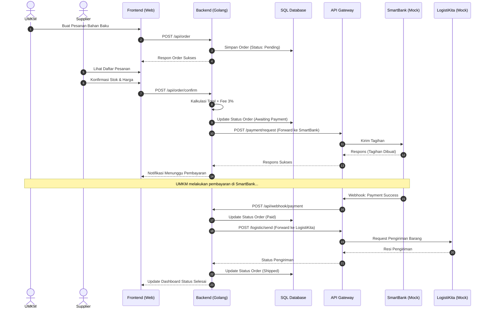
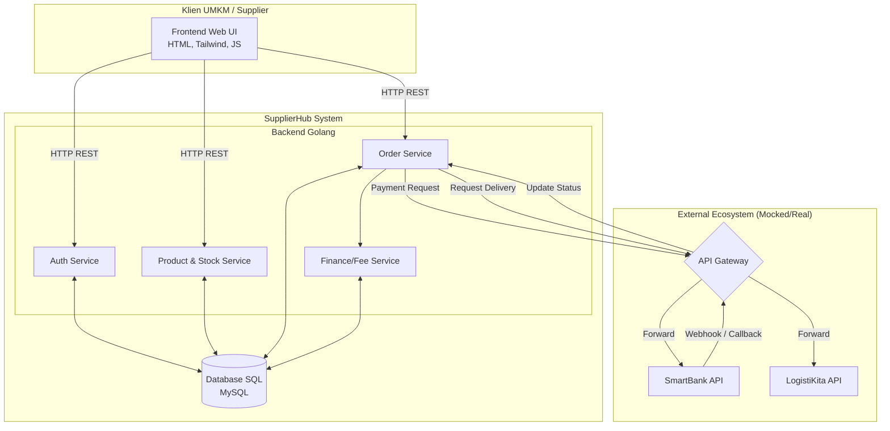

# SupplierHub - Product Requirements Document (PRD) Overview

## 1. Pendahuluan

**SupplierHub** adalah aplikasi B2B (Business-to-Business) yang dirancang untuk menjadi jembatan ekosistem antara UMKM dan Supplier bahan baku. Aplikasi ini memfasilitasi pemesanan bahan baku oleh UMKM, manajemen stok dan harga oleh Supplier, serta terintegrasi langsung dengan ekosistem luar seperti sistem pembayaran (SmartBank) dan logistik (LogistiKita) melalui API Gateway.

Dokumentasi ini dibuat untuk merancang pengembangan aplikasi yang berpedoman pada `TugasBesar_Plan.xlsx` dengan aturan pengerjaan dan keuangan yang ketat, termasuk pemotongan _fee_ layanan sebesar 3%.

## 2. Struktur PRD (Product Requirements Document)

Sesuai dengan rencana pengembangan, dokumentasi teknis ini dibagi menjadi beberapa bagian untuk mempermudah pengerjaan secara modular:

1. **`readme.md`** (Dokumen ini) - Overview sistem, Arsitektur Makro, dan Workflow Bisnis.
2. **`dokumen/prd-frontend.md`** - Spesifikasi UI/UX, routing, state management (HTML, TailwindCSS, Vanilla JS).
3. **`dokumen/prd-backend.md`** - Spesifikasi arsitektur backend, Contract API, struktur Clean Code Golang, dan Database Relasional (SQL).
4. **`dokumen/prd-mock-server.md`** - Spesifikasi Mock API Server untuk testing Gateway, Bank, dan Logistik (simulasi ekosistem pihak ketiga).

---

## 3. Workflow Sistem (Alur Bisnis Utama)

Skenario transaksi yang dikelola oleh SupplierHub adalah sebagai berikut:

1. **Pemesanan (UMKM):** UMKM melakukan request pemesanan bahan baku melalui UI SupplierHub.
2. **Konfirmasi (Supplier):** Supplier menerima notifikasi pesanan, lalu mengonfirmasi ketersediaan stok bahan dan menetapkan harga final pesanan.
3. **Kalkulasi Biaya:** Sistem SupplierHub menghitung total pesanan dengan menambahkan _Fee Supplier_ sebesar **3%** (aturan keuangan ekosistem).
4. **Permintaan Pembayaran:** SupplierHub mengirimkan _Payment Request_ secara terpusat ke **SmartBank** melalui **API Gateway**. Aplikasi tidak menahan saldo uang, melainkan meneruskan tagihan.
5. **Penyelesaian Transaksi:** SmartBank memproses pembayaran. Jika berhasil, SmartBank mengirimkan notifikasi status sukses ke SupplierHub (via Gateway).
6. **Pengiriman Logistik:** SupplierHub meng-update status pesanan menjadi Lunas (Paid) dan memicu panggilan API ke **LogistiKita** untuk memulai proses pengiriman dari Supplier ke UMKM.

### Diagram Workflow



---

## 4. Arsitektur Sistem

Arsitektur aplikasi akan dipisahkan menjadi komponen Frontend, Backend, dan Mock Server. Backend akan ditulis dalam Golang dengan pola _Clean Architecture_ / MVC. Aplikasi ini terhubung dengan sistem eksternal menggunakan API Gateway sebagai pintu masuk/keluar terpusat.



---

## 5. Ringkasan Teknologi

- **Frontend**: HTML5, TailwindCSS, Vanilla JavaScript (Fetch API untuk integrasi Backend).
- **Backend**: Golang (Gin/Fiber/Standar HTTP) dengan arsitektur Clean Code.
- **Database**: MySQL Relational Database.
- **Mock Server**: Node.js/Python/Go sederhana untuk simulasi SmartBank, LogistiKita, dan API Gateway.

---

## 6. Panduan Instalasi dan Menjalankan Aplikasi

Ikuti langkah-langkah di bawah ini untuk menjalankan aplikasi SupplierHub di lingkungan lokal Anda.

### Prasyarat
- Pasang **Go** compiler (versi 1.20 ke atas).
- Pasang **MySQL Server** (misalnya melalui XAMPP atau MySQL Installer).
- Web Browser modern (Chrome, Edge, Firefox, dll.).

### Langkah 1: Setup Database MySQL
1. Pastikan MySQL Server Anda berjalan (default port `3306`).
2. Masuk ke MySQL CLI atau phpMyAdmin, lalu buat database baru bernama `supplierhub`:
   ```sql
   CREATE DATABASE supplierhub;
   ```
3. Anda tidak perlu membuat tabel secara manual karena backend Golang akan melakukan **Auto Migration** saat dijalankan pertama kali.

### Langkah 2: Konfigurasi Environment Backend
1. Pastikan file konfigurasi `.env` pada folder `backend/` telah dibuat dan disesuaikan dengan kebutuhan server Anda sebelum menjalankan aplikasi.


### Langkah 3: Menjalankan Backend Server
1. Buka terminal (PowerShell/CMD/Bash) di dalam direktori `backend/`.
2. Jalankan server menggunakan perintah berikut:
   ```bash
   go run main.go
   ```
3. Backend akan berjalan di `http://localhost:8080`. Pada saat pertama kali dijalankan, server akan secara otomatis memigrasikan skema tabel dan memasukkan data uji coba default (seeder) ke database.

### Langkah 4: Menjalankan Frontend Web
1. Karena antarmuka frontend dibangun menggunakan HTML5 statis dan Vanilla JS, Anda dapat menjalankannya dengan cara:
   - Membuka file `index.html` langsung dari file explorer pada peramban Anda.
   - Atau menyajikannya lewat web server lokal sederhana untuk performa lebih baik (misalnya menggunakan ekstensi **Live Server** di VS Code, atau menjalankan `npx http-server ./` pada root direktori project).
2. Akses antarmuka tersebut di browser Anda untuk mulai menjelajah.

---

## 7. Penerapan Algoritma Inti

Untuk memenuhi standar efisiensi pengolahan data, SupplierHub menerapkan tiga algoritma utama di sisi backend (`backend/controllers/umkm_controller.go`):

1. **Knuth-Morris-Pratt (KMP) (Pencarian)**:
   Digunakan pada fitur pencarian katalog produk. Ketika pengguna mencari bahan baku, algoritma KMP mencocokkan pola pencarian kata kunci dengan nama produk, kategori, lokasi, atau nama supplier secara case-insensitive tanpa memotong string secara brute force.
2. **Quick Sort (Pengurutan)**:
   Digunakan untuk mengurutkan daftar produk berdasarkan harga secara cepat. Fitur ini mendukung pengurutan harga termurah ke termahal (`price_asc`) maupun sebaliknya (`price_desc`).
3. **Binary Search (Validasi)**:
   Digunakan untuk memvalidasi keberadaan `item_id` sebelum proses pembuatan transaksi (`CreateOrder`). Sistem akan mengurutkan seluruh ID produk terlebih dahulu, kemudian mencari ID produk tujuan menggunakan pencarian biner demi efisiensi proses pemeriksaan.

## 8. Pengujian & Registrasi Akun

Untuk menguji berbagai fitur di dalam aplikasi, Anda dapat mendaftarkan akun baru secara langsung melalui antarmuka web:
1. **Peran UMKM (User)**: Lakukan registrasi mandiri melalui tombol **Gabung Sekarang** di halaman utama.
2. **Peran Supplier**: Lakukan registrasi melalui halaman registrasi dan unggah dokumen legalitas. Admin perlu menyetujui akun supplier agar statusnya menjadi aktif.
3. **Peran Admin**: Menggunakan akun admin default yang otomatis dikonfigurasi melalui seeder database internal kelompok.


---

**Status Dokumen:** ✅ Selesai & Terimplementasi
_Aplikasi SupplierHub siap dijalankan, diuji secara end-to-end, dan digunakan untuk demo ekosistem B2B._
