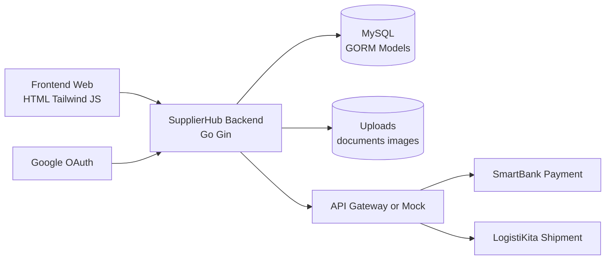

# Blueprint SRS SupplierHub Versi 2.0

Dokumen ini adalah blueprint penyusunan Software Requirements Specification (SRS) untuk proyek SupplierHub berdasarkan kondisi repository per 17 Juni 2026. Blueprint ini menggabungkan target produk dari PRD, implementasi aktual backend/frontend, serta gap yang perlu ditandai ketika SRS final disusun.

## Ringkasan Analisis Proyek

SupplierHub adalah aplikasi marketplace B2B yang mempertemukan UMKM sebagai pembeli bahan baku dengan Supplier sebagai penyedia produk/stok. Sistem memiliki tiga role utama: `user` atau UMKM, `supplier`, dan `admin`.

Implementasi saat ini terdiri dari:

- Frontend statis: HTML5, Tailwind CDN, Vanilla JavaScript, localStorage session, dashboard role-based.
- Backend Go: Gin, GORM, MySQL, JWT, bcrypt, Google OAuth, AutoMigrate.
- Domain inti: User, Product, Order, Payment, FinanceLog, RequestLog, ShipmentLog, Notification, ChatConversation, ChatMessage, Wishlist, Review, Log.
- Integrasi eksternal: sudah ada service client dan endpoint mock lokal untuk SmartBank dan LogistiKita.
- Workflow penting: katalog produk, wishlist, chat UMKM-Supplier, order bahan, konfirmasi stok supplier, payment request SmartBank, callback pembayaran, shipment LogistiKita, monitoring admin, review produk.

Catatan gap untuk SRS final:

- PRD awal masih menyebut endpoint lama seperti `/api/items` dan `/api/orders`, sementara implementasi aktif memakai `/api/user/*`, `/api/supplier/*`, `/api/admin/*`, dan `/supplierhub/*`.
- Mock server terpisah sesuai PRD belum berupa folder mandiri, tetapi mock endpoint tersedia langsung di backend.
- Beberapa halaman dashboard sudah terhubung API, tetapi SRS perlu membedakan kebutuhan produk dari kondisi implementasi saat ini.
- Tidak terlihat konfigurasi test suite, CI/CD, linter frontend, atau migration versioning selain GORM AutoMigrate.

## Pendahuluan dan Konteks Dokumen

### 1.1 Tujuan Dokumen

Blueprint SRS harus menjelaskan kebutuhan sistem SupplierHub secara formal agar dapat menjadi acuan:

- Pengembangan backend, frontend, dan integrasi eksternal.
- Validasi scope fitur oleh tim.
- Penyusunan acceptance criteria dan traceability matrix.
- Pengujian end-to-end transaksi UMKM sampai pengiriman.
- Penyesuaian PRD lama dengan implementasi aktual repository.

Isi yang perlu ditulis dalam SRS final:

- Identitas dokumen: nama dokumen, versi, tanggal, penyusun, reviewer.
- Tujuan SRS: mengikat requirement fungsional dan non-fungsional SupplierHub.
- Audiens dokumen: product owner, developer frontend/backend, tester, dosen/asessor, dan tim integrasi eksternal.
- Referensi sumber: README, PRD frontend/backend/mock, steering docs, route backend, model GORM, dashboard HTML/JS.

### 1.2 Ruang Lingkup Produk

SupplierHub mencakup platform B2B untuk:

- Registrasi dan login multi-role: UMKM, Supplier, Admin.
- Pengelolaan profil bisnis.
- Katalog bahan baku dan supplier publik.
- Manajemen bahan baku oleh Supplier.
- Pemesanan bahan oleh UMKM.
- Konfirmasi stok oleh Supplier.
- Perhitungan biaya layanan sebesar 3 persen.
- Payment request ke SmartBank melalui API Gateway/mock.
- Payment callback dari SmartBank/API Gateway.
- Pembuatan shipment ke LogistiKita setelah pembayaran sukses.
- Monitoring admin untuk supplier, stok, transaksi, keuangan, log, dan notifikasi.
- Chat antara UMKM dan Supplier.
- Wishlist produk oleh UMKM.
- Review produk setelah pesanan selesai.

Scope implementasi yang perlu diberi label dalam SRS:

- `Core`: auth, katalog, produk, order, fee, supplier verification.
- `Operational`: payment, shipment, finance log, request log, notification.
- `Supporting`: chat, wishlist, review, dashboard analytics.
- `Integration`: SmartBank, LogistiKita, API Gateway, Google OAuth.

### 1.3 Out of Scope

SRS final perlu menegaskan hal yang tidak menjadi cakupan versi ini:

- Pengelolaan saldo internal atau escrow. SupplierHub hanya membuat request pembayaran dan menyimpan jejak status.
- Settlement uang nyata ke rekening supplier.
- Real-time chat berbasis WebSocket. Implementasi saat ini menggunakan polling.
- Mobile native app.
- Multi-warehouse, batch inventory, atau forecasting stok.
- Sistem voucher nyata dan loyalty point terintegrasi. Dashboard UMKM saat ini menampilkan nilai default/derived.
- SLA produksi penuh untuk SmartBank/LogistiKita jika masih memakai mock.
- Payment dispute, refund, invoice pajak, dan rekonsiliasi bank lanjutan.
- Deployment production, CI/CD, dan observability penuh jika belum didefinisikan terpisah.

## Gambaran Produk dan Batas Sistem

### 2.1 Product Perspective

SupplierHub berperan sebagai web platform yang berada di tengah ekosistem:

- UMKM menggunakan browser untuk mencari produk, menghubungi supplier, memesan, membayar, melacak, dan memberi review.
- Supplier menggunakan dashboard untuk mengelola toko, produk, stok, notifikasi, chat, dan pesanan.
- Admin menggunakan dashboard untuk memverifikasi supplier, memonitor stok, transaksi, pendapatan fee, dan aktivitas sistem.
- Backend SupplierHub menyimpan data operasional dan menjalankan aturan bisnis.
- Sistem eksternal SmartBank menangani status pembayaran.
- Sistem eksternal LogistiKita menangani pembuatan pengiriman.
- API Gateway menjadi jalur komunikasi eksternal yang dapat dimock saat development.

Batas sistem:

- Dalam batas SupplierHub: frontend HTML/JS, backend Go, MySQL, upload files, logs, notifications.
- Di luar batas SupplierHub: otorisasi Google, payment processing SmartBank, shipment processing LogistiKita, API Gateway eksternal.

### 2.2 User Classes dan Karakteristik

| User Class | Karakteristik | Hak Akses Utama | Catatan SRS |
| --- | --- | --- | --- |
| UMKM atau `user` | Pembeli bahan baku, membutuhkan katalog, order, chat, tracking | Login, profil, katalog, order, cancel/complete order, wishlist, chat, review | Role backend adalah `user`, bukan `umkm` |
| Supplier | Penjual/penyedia stok, butuh manajemen produk dan pesanan | Profil toko, CRUD produk, lihat pesanan, konfirmasi stok, update status, notifikasi, chat | Supplier harus aktif untuk menambah/mengubah produk |
| Admin | Pengelola platform dan verifier ekosistem | Dashboard statistik, verifikasi supplier, update status supplier, finance, stock summary, log, notification | Admin default dibuat pada seeding development |
| Sistem Eksternal | SmartBank, LogistiKita, API Gateway | Callback payment, menerima payment/shipment request | Harus didefinisikan sebagai aktor non-human |

### 2.3 Operating Environment

Backend:

- Bahasa: Go.
- Framework: Gin.
- ORM: GORM.
- Database aktif: MySQL.
- Auth: JWT HMAC, bcrypt.
- OAuth: Google OAuth.
- Upload/static: folder `uploads` disajikan via `/uploads`.
- Port default: `8080`.

Frontend:

- HTML statis di root, `Login/`, dan `dashboard/`.
- TailwindCSS via CDN.
- Vanilla JavaScript dan Fetch API.
- Session utama: `localStorage.user_session`.
- API base URL default: `http://localhost:8080`.

Environment variable yang perlu masuk SRS:

- `DATABASE_URL`.
- `JWT_SECRET`.
- `APP_BASE_URL`.
- `API_GATEWAY_URL`.
- `SMARTBANK_GATEWAY_URL`.
- `SMARTBANK_PAYMENT_PATH`.
- `LOGISTIKITA_SHIPMENT_PATH`.
- `SUPPLIERHUB_CALLBACK_URL`.
- `SUPPLIERHUB_CALLBACK_API_KEY`.
- `GOOGLE_CLIENT_ID`.
- `GOOGLE_CLIENT_SECRET`.
- `GOOGLE_REDIRECT_URL`.

## Konteks Operasional dan Arsitektur

### 3.1 Architectural Overview

Arsitektur yang perlu digambarkan dalam SRS:



Layer backend aktual:

- `config`: database, app base URL, OAuth.
- `models`: GORM entity dan enum domain.
- `middlewares`: JWT role auth, request logger.
- `controllers`: handler HTTP dan business logic endpoint.
- `services`: gateway client, finance log, shipment log, notification.
- `routes`: pemetaan endpoint.

Keputusan arsitektural yang harus dinyatakan:

- Backend menjadi sumber kebenaran untuk harga, stok, fee, status order, dan status payment.
- Frontend tidak boleh menghitung fee sebagai sumber kebenaran.
- Akses fitur dibatasi role melalui JWT dan middleware.
- Callback payment dapat dilindungi `SUPPLIERHUB_CALLBACK_API_KEY`.
- Log request hanya dicatat untuk workflow SupplierHub tertentu.

### 3.2 Data Flow

Data flow utama yang harus dicantumkan:

1. Registrasi/Login:
   - User mengirim credential atau OAuth.
   - Backend validasi, hash password, atau tukar token OAuth.
   - Backend mengembalikan JWT dan profil dasar.
   - Frontend menyimpan `user_session`.

2. Katalog dan wishlist:
   - UMKM mengambil katalog publik atau katalog user.
   - Backend membaca Product + Supplier + Review stats.
   - UMKM menambah/menghapus wishlist.

3. Order bahan:
   - UMKM memilih product dan quantity.
   - Backend validasi produk, stok, dan quantity.
   - Backend menghitung `total_base_price`, `system_fee`, `grand_total`.
   - Backend membuat Order status `pending_supplier_confirmation`.
   - Backend membuat FinanceLog tipe `order_created`.

4. Konfirmasi stok:
   - Supplier mengonfirmasi atau menolak order.
   - Backend lock order dan product.
   - Jika confirm, stok dikurangi, Payment dibuat, payment request dikirim ke SmartBank via Gateway.
   - Order berubah ke `payment_pending` atau `payment_request_failed`.
   - Jika reject atau stok kurang, order berubah ke status yang sesuai.

5. Callback pembayaran:
   - SmartBank/Gateway mengirim callback ke SupplierHub.
   - Backend validasi callback token jika dikonfigurasi.
   - Payment berubah ke `success` atau `failed`.
   - Order berubah ke `paid` atau `payment_failed`.
   - Jika sukses, backend memanggil LogistiKita.
   - Jika shipment sukses, order berubah ke `shipment_created`.

6. Operasional setelah pembayaran:
   - Supplier dapat update order dari `paid` ke `processing`, lalu `shipped`, lalu `completed` sesuai aturan transisi.
   - UMKM dapat complete order untuk status tertentu.
   - UMKM dapat review setelah order `completed`.

## Domain Data dan Aturan Bisnis

### 4.1 Core Domain Entities

| Entity | Deskripsi | Field Penting | Relasi |
| --- | --- | --- | --- |
| User | Akun UMKM, Supplier, Admin | `id`, `business_name`, `email`, `password_hash`, `role`, `address`, `category`, `region`, `pic_name`, `phone`, `document_url`, `status` | Product, Order, Chat, Wishlist |
| Product | Bahan baku milik Supplier | `id`, `supplier_id`, `name`, `category`, `price`, `stock`, `description`, `location`, `image_url` | Supplier, Order, Review, Wishlist |
| Order | Transaksi pemesanan UMKM ke Supplier | `id`, `umkm_id`, `supplier_id`, `product_id`, `quantity`, `total_base_price`, `system_fee`, `grand_total`, `status`, `stock_deducted` | Product, Umkm, Supplier, Payment |
| Payment | Jejak request/status pembayaran SmartBank | `order_id`, `user_id`, `amount`, `supplier_fee`, `status`, `virtual_account`, `payment_reference`, `external_order_id`, `gateway_status`, `callback_status`, `paid_at` | Order, User |
| FinanceLog | Ledger/audit biaya layanan | `order_id`, `payment_id`, `subtotal`, `supplier_fee`, `grand_total`, `payment_status`, `order_status`, `transaction_type` | Order, Payment |
| ShipmentLog | Jejak request shipment LogistiKita | `order_id`, `shipment_id`, `status`, `gateway_response`, `error_message` | Order |
| Notification | Notifikasi role/user | `user_id`, `role`, `title`, `message`, `type`, `source_type`, `source_id`, `is_read` | User |
| ChatConversation | Kanal chat UMKM-Supplier | `umkm_id`, `supplier_id`, `last_message`, `last_sender_id`, `last_message_at` | User, ChatMessage |
| ChatMessage | Pesan dalam conversation | `conversation_id`, `sender_id`, `receiver_id`, `message`, `is_read` | Conversation, User |
| Wishlist | Produk favorit UMKM | `user_id`, `bahan_baku_id` | User, Product |
| Review | Rating dan komentar produk | `order_id`, `product_id`, `umkm_id`, `rating`, `comment` | User, Product/Order |
| Log | Audit aktivitas umum | `user_id`, `action`, `description` | User |
| RequestLog | Audit request workflow SupplierHub | `method`, `path`, `status_code`, `request_body`, `response_message`, `latency_ms` | User optional |

Status enum yang harus dinormalisasi di SRS:

- User status: `pending`, `active`, `suspended`.
- Role: `user`, `supplier`, `admin`.
- Order status: `pending`, `pending_supplier_confirmation`, `rejected_by_supplier`, `stock_unavailable`, `supplier_confirmed`, `payment_pending`, `payment_request_failed`, `paid`, `payment_failed`, `shipment_created`, `processing`, `shipped`, `completed`, `cancelled`.
- Payment status: `pending`, `success`, `failed`.

### 4.2 Business Rules

BR-001: Role valid hanya `user`, `supplier`, dan `admin`.

BR-002: Email user harus unik.

BR-003: Password disimpan sebagai hash bcrypt dan tidak boleh dikirim dalam JSON response.

BR-004: Supplier yang registrasi normal wajib mengunggah dokumen legalitas.

BR-005: Status user default adalah `pending`; supplier harus `active` untuk menambah atau mengubah produk.

BR-006: Harga produk tidak boleh negatif.

BR-007: Stok produk tidak boleh negatif.

BR-008: Quantity order minimal 1.

BR-009: Order tidak boleh dibuat jika quantity melebihi stok produk saat validasi awal.

BR-010: Backend menghitung `total_base_price = product.price * quantity`.

BR-011: Backend menghitung `system_fee = total_base_price * 0.03`.

BR-012: Backend menghitung `grand_total = total_base_price + system_fee`.

BR-013: Order baru berstatus `pending_supplier_confirmation`.

BR-014: Stok dikurangi saat Supplier melakukan confirm stok, bukan saat UMKM membuat order.

BR-015: Konfirmasi stok harus menggunakan lock transaksi untuk mencegah race condition.

BR-016: Supplier hanya boleh mengonfirmasi order miliknya.

BR-017: Jika Supplier reject, status order menjadi `rejected_by_supplier`.

BR-018: Jika stok tidak mencukupi saat confirm, status order menjadi `stock_unavailable`.

BR-019: Payment request dibuat setelah stok dikonfirmasi.

BR-020: Jika payment request gagal, Payment menjadi `failed` dan Order menjadi `payment_request_failed`.

BR-021: Callback payment sukses mengubah Payment menjadi `success` dan Order menjadi `paid`.

BR-022: Callback payment gagal mengubah Payment menjadi `failed` dan Order menjadi `payment_failed`.

BR-023: Shipment request ke LogistiKita dipicu setelah callback payment sukses.

BR-024: Jika shipment sukses, Order menjadi `shipment_created` dan ShipmentLog disimpan.

BR-025: Jika shipment gagal setelah payment sukses, response callback boleh `warning`, Payment tetap sukses, dan ShipmentLog mencatat error.

BR-026: Supplier status transition reguler: `paid -> processing -> shipped -> completed`.

BR-027: UMKM hanya boleh membatalkan order saat status `pending` atau `pending_supplier_confirmation`.

BR-028: UMKM hanya boleh memberi review untuk order miliknya yang sudah `completed`.

BR-029: Satu order hanya boleh memiliki satu review.

BR-030: Rating review harus 1 sampai 5.

BR-031: Chat hanya untuk role `user` dan `supplier`.

BR-032: UMKM dapat memulai chat dengan Supplier; Supplier membaca/membalas chat yang terkait dengannya.

BR-033: Pesan chat tidak boleh kosong dan maksimal 2000 karakter.

BR-034: Wishlist unik per kombinasi user dan product.

BR-035: Admin dapat memverifikasi, mengaktifkan, menunda, atau suspend supplier.

BR-036: Admin dapat mengirim peringatan stok rendah kepada supplier.

BR-037: Request sensitif seperti password/token harus direduksi dari RequestLog.

## Kebutuhan Fungsional

Gunakan format requirement ID berikut untuk SRS final.

### Auth dan Session

| ID | Kebutuhan | Aktor | Prioritas | Status Implementasi |
| --- | --- | --- | --- | --- |
| FR-AUTH-001 | Sistem harus menyediakan registrasi UMKM dan Supplier | UMKM, Supplier | Must | Ada |
| FR-AUTH-002 | Sistem harus menolak email yang sudah terdaftar | Semua | Must | Ada |
| FR-AUTH-003 | Sistem harus mewajibkan dokumen legalitas untuk Supplier | Supplier | Must | Ada |
| FR-AUTH-004 | Sistem harus menyediakan login email/password dan menerbitkan JWT | Semua | Must | Ada |
| FR-AUTH-005 | Sistem harus menolak login akun `suspended` | Semua | Must | Ada |
| FR-AUTH-006 | Sistem harus mendukung Google OAuth untuk login/registrasi lanjutan | Semua | Should | Ada |
| FR-AUTH-007 | Frontend harus menyimpan session dalam `localStorage.user_session` | Semua | Must | Ada |

### Katalog, Produk, dan Supplier

| ID | Kebutuhan | Aktor | Prioritas | Status Implementasi |
| --- | --- | --- | --- | --- |
| FR-CAT-001 | Sistem harus menampilkan katalog produk publik | Publik/UMKM | Must | Ada |
| FR-CAT-002 | Sistem harus mendukung pencarian katalog berdasarkan nama, kategori, lokasi, supplier | UMKM | Must | Ada |
| FR-CAT-003 | Sistem harus mendukung sorting harga naik/turun | UMKM | Should | Ada |
| FR-CAT-004 | Sistem harus menampilkan rating rata-rata dan jumlah review produk | Publik/UMKM | Should | Ada |
| FR-CAT-005 | Sistem harus menampilkan daftar supplier aktif secara publik | Publik | Should | Ada |
| FR-CAT-006 | Sistem harus menampilkan detail supplier hanya untuk user terautentikasi | UMKM/Supplier/Admin | Should | Ada |
| FR-PROD-001 | Supplier aktif harus dapat menambah produk | Supplier | Must | Ada |
| FR-PROD-002 | Supplier aktif harus dapat mengubah produk miliknya | Supplier | Must | Ada |
| FR-PROD-003 | Supplier harus dapat menghapus produk miliknya | Supplier | Should | Ada |
| FR-PROD-004 | Admin harus dapat melihat ringkasan stok seluruh produk | Admin | Must | Ada |
| FR-PROD-005 | Admin harus dapat mengirim notifikasi low stock kepada supplier | Admin | Should | Ada |

### Order, Fee, Payment, Shipment

| ID | Kebutuhan | Aktor | Prioritas | Status Implementasi |
| --- | --- | --- | --- | --- |
| FR-ORD-001 | UMKM harus dapat membuat order dari produk dan quantity | UMKM | Must | Ada |
| FR-ORD-002 | Sistem harus memvalidasi eksistensi produk sebelum order | Sistem | Must | Ada |
| FR-ORD-003 | Sistem harus menolak order jika stok tidak cukup | Sistem | Must | Ada |
| FR-ORD-004 | Sistem harus menghitung subtotal, fee 3 persen, dan grand total di backend | Sistem | Must | Ada |
| FR-ORD-005 | Sistem harus menyimpan FinanceLog saat order dibuat | Sistem | Must | Ada |
| FR-ORD-006 | Supplier harus dapat melihat order miliknya | Supplier | Must | Ada |
| FR-ORD-007 | Supplier harus dapat confirm/reject stok order | Supplier | Must | Ada |
| FR-ORD-008 | Sistem harus mengurangi stok saat supplier confirm | Sistem | Must | Ada |
| FR-PAY-001 | Sistem harus membuat Payment setelah stok dikonfirmasi | Sistem | Must | Ada |
| FR-PAY-002 | Sistem harus mengirim payment request ke SmartBank/API Gateway | Sistem eksternal | Must | Ada |
| FR-PAY-003 | Sistem harus menerima callback payment sukses/gagal | SmartBank/Gateway | Must | Ada |
| FR-PAY-004 | Sistem harus menyimpan payment reference, virtual account, gateway status | Sistem | Must | Ada |
| FR-SHIP-001 | Sistem harus membuat request shipment ke LogistiKita setelah payment sukses | Sistem eksternal | Must | Ada |
| FR-SHIP-002 | Sistem harus menyimpan ShipmentLog sukses/gagal | Sistem | Must | Ada |
| FR-ORD-009 | UMKM harus dapat membatalkan order pending | UMKM | Should | Ada |
| FR-ORD-010 | UMKM atau Supplier harus dapat menyelesaikan order sesuai status valid | UMKM/Supplier | Should | Ada |

### Admin, Notification, Chat, Wishlist, Review

| ID | Kebutuhan | Aktor | Prioritas | Status Implementasi |
| --- | --- | --- | --- | --- |
| FR-ADM-001 | Admin harus dapat melihat statistik platform | Admin | Must | Ada |
| FR-ADM-002 | Admin harus dapat memverifikasi Supplier | Admin | Must | Ada |
| FR-ADM-003 | Admin harus dapat mengubah status Supplier | Admin | Must | Ada |
| FR-ADM-004 | Admin harus dapat melihat ringkasan keuangan | Admin | Must | Ada |
| FR-ADM-005 | Admin harus dapat melihat log aktivitas | Admin | Should | Ada |
| FR-NOTIF-001 | Sistem harus membuat notifikasi untuk event penting | Semua | Should | Ada |
| FR-NOTIF-002 | User harus dapat menandai notifikasi sebagai dibaca | Admin/Supplier | Should | Ada |
| FR-CHAT-001 | UMKM harus dapat membuat conversation dengan Supplier | UMKM | Should | Ada |
| FR-CHAT-002 | UMKM dan Supplier harus dapat saling mengirim pesan | UMKM/Supplier | Should | Ada |
| FR-CHAT-003 | Sistem harus menandai pesan masuk sebagai dibaca saat dibuka | UMKM/Supplier | Should | Ada |
| FR-WISH-001 | UMKM harus dapat menambah produk ke wishlist | UMKM | Could | Ada |
| FR-WISH-002 | UMKM harus dapat melihat dan menghapus wishlist | UMKM | Could | Ada |
| FR-REV-001 | UMKM harus dapat memberi rating dan komentar setelah order selesai | UMKM | Should | Ada |
| FR-REV-002 | Publik/UMKM harus dapat melihat review produk | Publik/UMKM | Should | Ada |

## Kebutuhan Non-Fungsional

| ID | Kategori | Kebutuhan | Ukuran/Acceptance Target |
| --- | --- | --- | --- |
| NFR-SEC-001 | Security | Semua endpoint bisnis harus membutuhkan JWT | Request tanpa JWT menghasilkan 401 |
| NFR-SEC-002 | Security | Role-based access control harus diterapkan | Role salah menghasilkan 403 |
| NFR-SEC-003 | Security | Password harus di-hash bcrypt | Tidak ada password plaintext di DB/response |
| NFR-SEC-004 | Security | Callback dapat dilindungi API key | Header token salah menghasilkan 401 jika env aktif |
| NFR-SEC-005 | Security | RequestLog harus meredaksi password/token | Field sensitif menjadi `[redacted]` |
| NFR-DATA-001 | Data Integrity | Transaksi confirm stok harus atomic | Order dan stok konsisten saat concurrent request |
| NFR-DATA-002 | Data Integrity | Fee dihitung di backend | Frontend tidak menjadi sumber nilai fee |
| NFR-DATA-003 | Data Integrity | Entity utama memakai UUID string | ID auto-generated oleh hook GORM |
| NFR-PERF-001 | Performance | Katalog harus bisa dicari/sortir responsif untuk data development | Response katalog normal < 2 detik pada dataset kecil/menengah |
| NFR-PERF-002 | Performance | Gateway call harus memiliki timeout | Timeout default 10 detik |
| NFR-UX-001 | Usability | Dashboard role-based harus redirect jika role salah | User tidak melihat dashboard role lain |
| NFR-UX-002 | Usability | UI harus memberi feedback error/sukses | Toast/alert muncul untuk aksi utama |
| NFR-MAINT-001 | Maintainability | Backend mengikuti struktur config/controllers/models/routes/middlewares/services | Modul baru ditempatkan sesuai domain |
| NFR-MAINT-002 | Maintainability | Response error memakai `{ "error": "..." }` | Frontend dapat membaca error konsisten |
| NFR-OBS-001 | Observability | Aktivitas penting dicatat ke Log/RequestLog/FinanceLog/ShipmentLog | Event order/payment/shipment dapat diaudit |
| NFR-COMP-001 | Compatibility | Frontend harus berjalan sebagai HTML statis | Tidak wajib build tool |
| NFR-CONF-001 | Configurability | URL eksternal dan secret harus lewat environment variable | Tidak memakai default secret di production |

## Antarmuka Eksternal

### 7.1 User Interface Requirements

SRS final perlu mendefinisikan halaman berikut.

Publik:

- `index.html`: landing/product overview, daftar supplier publik.
- `Login/login.html`: login, register UMKM, register Supplier, Google OAuth popup.

UMKM:

- `dashboard/umkm.html`: overview statistik dan ringkasan order.
- `dashboard/umkm_katalog.html`: katalog produk, pencarian, filter, order, review, chat supplier.
- `dashboard/umkm_pesanan_saya.html`: riwayat order, cancel, simulasi callback/payment, review.
- `dashboard/umkm_lacak_paket.html`: tracking/status order dan complete order.
- `dashboard/umkm_wishlist.html`: daftar wishlist.
- `dashboard/umkm_chat.html`: chat supplier.
- `dashboard/umkm_profil.html`: profil UMKM.
- `dashboard/umkm_bantuan.html`: bantuan.

Supplier:

- `dashboard/supplier.html`: dashboard ringkasan.
- `dashboard/supplier_produk_saya.html`: CRUD produk.
- `dashboard/supplier_daftar_pesanan.html`: order masuk dan update/confirm status.
- `dashboard/supplier_chat.html`: chat UMKM.
- `dashboard/supplier_notifikasi.html`: notifikasi supplier.
- `dashboard/supplier_analitik.html`: analitik toko.
- `dashboard/supplier_toko.html`: profil toko.

Admin:

- `dashboard/admin.html`: overview command center.
- `dashboard/admin_daftar_supplier.html`: daftar/verifikasi/update status supplier.
- `dashboard/admin_kontrol_stok.html`: ringkasan stok dan low stock alert.
- `dashboard/admin_keuangan.html`: ringkasan finance.
- `dashboard/admin_pengaturan.html`: profil admin.

UI rules:

- Gunakan Bahasa Indonesia untuk label dan error.
- Gunakan format Rupiah `id-ID`.
- Gunakan badge semantik untuk status order/payment/supplier.
- Setiap halaman role-based harus validasi session dan role sebelum render data.
- Setiap aksi async harus memiliki loading/disabled state dan notifikasi hasil.

### 7.2 API Requirements

Endpoint publik:

| Method | Endpoint | Fungsi |
| --- | --- | --- |
| POST | `/api/auth/register` | Registrasi UMKM/Supplier |
| POST | `/api/auth/login` | Login dan JWT |
| GET | `/api/auth/google` | Mulai Google OAuth |
| GET | `/api/auth/google/callback` | Callback Google OAuth |
| GET | `/api/catalog` | Katalog produk publik |
| GET | `/api/catalog/products/:id/reviews` | Review produk publik |
| GET | `/api/public/suppliers` | Daftar supplier aktif |
| POST | `/api/webhook/payment` | Alias callback payment |
| POST | `/smartbank/payment/request` | Mock SmartBank request |
| POST | `/smartbank/payment/simulate-callback` | Mock callback SmartBank |
| POST | `/logistikita/shipment/create` | Mock shipment LogistiKita |

Endpoint SupplierHub workflow:

| Method | Endpoint | Role | Fungsi |
| --- | --- | --- | --- |
| GET | `/supplierhub/manajemen_bahan_baku` | supplier/admin | Lihat bahan baku |
| POST | `/supplierhub/manajemen_bahan_baku` | supplier | Tambah bahan baku |
| PUT | `/supplierhub/manajemen_bahan_baku/:id` | supplier/admin | Ubah bahan baku |
| DELETE | `/supplierhub/manajemen_bahan_baku/:id` | supplier/admin | Hapus bahan baku |
| POST | `/supplierhub/order_bahan` | user | Buat order bahan |
| PUT | `/supplierhub/konfirmasi_stok/:order_id` | supplier | Confirm/reject stok |
| GET | `/supplierhub/biaya_layanan_supplier` | supplier/admin | Summary fee |
| POST | `/supplierhub/payment/callback` | eksternal | Callback payment |
| POST | `/supplierhub/pembayaran` | user | Payment request legacy/alternatif |

Endpoint UMKM:

| Method | Endpoint | Fungsi |
| --- | --- | --- |
| GET | `/api/user/profile` | Profil UMKM |
| PUT | `/api/user/profile` | Update profil UMKM |
| GET | `/api/user/stats` | Statistik UMKM |
| GET | `/api/user/orders` | Daftar order UMKM |
| GET | `/api/user/products` | Katalog produk untuk UMKM |
| POST | `/api/user/orders` | Buat order |
| PUT | `/api/user/orders/:id/cancel` | Cancel order |
| PUT | `/api/user/orders/:id/complete` | Complete order |
| POST | `/api/user/reviews` | Buat review |
| GET | `/api/wishlist` | Lihat wishlist |
| POST | `/api/wishlist` | Tambah wishlist |
| DELETE | `/api/wishlist/:id` | Hapus wishlist |

Endpoint Supplier:

| Method | Endpoint | Fungsi |
| --- | --- | --- |
| GET | `/api/supplier/profile` | Profil supplier |
| PUT | `/api/supplier/profile` | Update profil supplier |
| GET | `/api/supplier/stats` | Statistik supplier |
| GET | `/api/supplier/products` | Produk supplier |
| POST | `/api/supplier/products` | Tambah produk |
| PUT | `/api/supplier/products/:id` | Update produk |
| DELETE | `/api/supplier/products/:id` | Hapus produk |
| GET | `/api/supplier/orders` | Daftar order supplier |
| PUT/POST | `/api/supplier/orders/update-status` | Update status order |
| PUT | `/api/supplier/orders/:id` | Update status order |
| GET | `/api/supplier/notifications` | Notifikasi supplier |
| PUT | `/api/supplier/notifications/:id/read` | Tandai notifikasi |

Endpoint Admin:

| Method | Endpoint | Fungsi |
| --- | --- | --- |
| GET | `/api/admin/stats` | Statistik platform |
| GET | `/api/admin/profile` | Profil admin |
| PUT | `/api/admin/profile` | Update profil admin |
| GET | `/api/admin/suppliers` | Daftar supplier |
| PUT | `/api/admin/suppliers/:id/verify` | Verifikasi supplier |
| PUT | `/api/admin/suppliers/:id/status` | Update status supplier |
| GET | `/api/admin/logs` | Log aktivitas |
| POST | `/api/admin/logs` | Buat log |
| GET | `/api/admin/finance` | Summary finance |
| GET | `/api/admin/stocks` | Summary stok |
| POST | `/api/admin/products/:id/stock-alert` | Kirim low stock alert |
| GET | `/api/admin/notifications` | Notifikasi admin |
| PUT | `/api/admin/notifications/:id/read` | Tandai notifikasi admin |

Endpoint Chat:

| Method | Endpoint | Role | Fungsi |
| --- | --- | --- | --- |
| GET | `/api/chat/conversations` | user/supplier | Daftar chat |
| POST | `/api/chat/conversations` | user | Buat chat dengan supplier |
| GET | `/api/chat/conversations/:id/messages` | user/supplier | Ambil pesan |
| POST | `/api/chat/conversations/:id/messages` | user/supplier | Kirim pesan |
| PUT | `/api/chat/conversations/:id/read` | user/supplier | Tandai terbaca |

### 7.3 Data Exchange Contract

Contoh request/response yang harus masuk SRS final.

Login request:

```json
{
  "email": "admin@supplierhub.com",
  "password": "admin123"
}
```

Login response:

```json
{
  "message": "Login berhasil",
  "token": "<jwt>",
  "role": "admin",
  "user": {
    "id": "<uuid>",
    "business_name": "System Administrator",
    "email": "admin@supplierhub.com",
    "status": "active"
  }
}
```

Create order request:

```json
{
  "product_id": "prod-tekstil-1",
  "quantity": 10
}
```

Order price contract:

```json
{
  "total_base_price": 450000,
  "system_fee": 13500,
  "grand_total": 463500,
  "status": "pending_supplier_confirmation"
}
```

Confirm stock request:

```json
{
  "action": "confirm",
  "note": "Stok tersedia"
}
```

Payment request to SmartBank/Gateway:

```json
{
  "external_order_id": "<order_id>",
  "user_id": "<umkm_id>",
  "supplier_id": "<supplier_id>",
  "amount": 463500,
  "subtotal": 450000,
  "service_fee": 13500,
  "callback_url": "http://localhost:8080/supplierhub/payment/callback"
}
```

SmartBank payment response:

```json
{
  "success": true,
  "payment_reference": "SB-12345678",
  "virtual_account": "880812345678",
  "status": "pending",
  "external_order_id": "<order_id>"
}
```

Payment callback request:

```json
{
  "payment_reference": "SB-12345678",
  "external_order_id": "<order_id>",
  "status": "success",
  "paid_at": "2026-06-17T15:00:00+07:00"
}
```

Shipment request to LogistiKita/Gateway:

```json
{
  "external_order_id": "<order_id>",
  "supplier_id": "<supplier_id>",
  "umkm_id": "<umkm_id>",
  "product_id": "<product_id>",
  "quantity": 10,
  "origin_region": "Bandung",
  "destination_address": "Alamat UMKM",
  "status": "waiting_pickup"
}
```

Chat message request:

```json
{
  "message": "Halo, apakah stok produk ini tersedia?"
}
```

Error response contract:

```json
{
  "error": "Pesan error dalam Bahasa Indonesia"
}
```

## Workflow Operasional

### WF-001 Registrasi dan Login

1. User membuka login/register.
2. User memilih role.
3. Jika Supplier, user mengunggah dokumen legalitas.
4. Backend membuat User status `pending`.
5. Admin memverifikasi Supplier menjadi `active`.
6. User login dan menerima JWT.
7. Frontend redirect ke dashboard sesuai role.

Acceptance criteria:

- Email duplikat ditolak 409.
- Supplier tanpa dokumen ditolak 400.
- Login sukses mengembalikan token dan role.
- Role salah tidak dapat membuka dashboard role lain.

### WF-002 Manajemen Bahan Baku

1. Supplier aktif membuka halaman produk.
2. Supplier mengisi nama, kategori, harga, stok, deskripsi, dan gambar opsional.
3. Backend validasi role, status supplier, region, harga, dan stok.
4. Product dibuat/diubah/dihapus.
5. Sistem membuat log dan notifikasi terkait.

Acceptance criteria:

- Supplier `pending` atau `suspended` tidak dapat menambah/mengubah produk.
- Harga dan stok negatif ditolak.
- Product tersimpan dengan `supplier_id` user login.

### WF-003 Order Bahan

1. UMKM membuka katalog.
2. UMKM mencari/sort produk.
3. UMKM memilih produk dan quantity.
4. Backend validasi produk dan stok.
5. Backend menghitung subtotal, fee 3 persen, grand total.
6. Backend membuat order status `pending_supplier_confirmation`.
7. Supplier dan Admin mendapat notifikasi.

Acceptance criteria:

- Quantity 0 ditolak.
- Produk tidak ditemukan ditolak.
- Stok tidak cukup ditolak.
- Fee selalu 3 persen dari subtotal.

### WF-004 Konfirmasi Stok dan Payment Request

1. Supplier membuka daftar pesanan.
2. Supplier memilih confirm atau reject.
3. Backend lock order dan product.
4. Jika reject, order menjadi `rejected_by_supplier`.
5. Jika confirm dan stok cukup, stok dikurangi.
6. Backend membuat Payment status `pending`.
7. Backend mengirim request ke SmartBank/API Gateway.
8. Jika sukses, order menjadi `payment_pending`.
9. Jika gagal, order menjadi `payment_request_failed`.

Acceptance criteria:

- Supplier tidak bisa confirm order supplier lain.
- Confirm ganda ditolak jika `stock_deducted` sudah true.
- Stok berkurang persis sebesar quantity.
- Payment record menyimpan response gateway.

### WF-005 Payment Callback dan Shipment

1. SmartBank/API Gateway mengirim callback.
2. Backend validasi token callback jika diaktifkan.
3. Backend mencari Payment by `payment_reference`, `external_order_id`, atau `order_id`.
4. Jika status gagal, Payment failed dan Order payment_failed.
5. Jika status sukses, Payment success dan Order paid.
6. Backend membuat shipment request ke LogistiKita/API Gateway.
7. Backend menyimpan ShipmentLog.
8. Jika shipment sukses, Order shipment_created.

Acceptance criteria:

- Callback tanpa identifier valid ditolak 400.
- Callback payment yang tidak ditemukan ditolak 404.
- Callback status selain success/paid/failed/cancelled ditolak 400.
- Payment sukses tetap tercatat meski shipment gagal.

### WF-006 Chat UMKM-Supplier

1. UMKM membuka profil/katalog supplier.
2. UMKM membuat conversation.
3. UMKM/Supplier mengirim pesan.
4. Sistem menyimpan last message dan notifikasi.
5. Pesan masuk ditandai read saat dibuka.

Acceptance criteria:

- Supplier tidak dapat memulai conversation baru lewat endpoint create.
- Pesan kosong ditolak.
- Pesan lebih dari 2000 karakter ditolak.
- Conversation hanya dapat diakses oleh UMKM/Supplier terkait.

### WF-007 Review Produk

1. UMKM menyelesaikan order.
2. UMKM memberi rating 1 sampai 5 dan komentar.
3. Backend validasi order milik UMKM dan status completed.
4. Review tersimpan dan muncul di katalog produk.

Acceptance criteria:

- Review order milik user lain ditolak 403.
- Review sebelum completed ditolak.
- Review kedua untuk order yang sama ditolak 409.

## Risiko, Kontrol, dan Acceptance Criteria

| Risiko | Dampak | Kontrol Saat Ini | Rekomendasi SRS/Acceptance |
| --- | --- | --- | --- |
| Endpoint PRD dan implementasi berbeda | Tester memakai contract salah | Steering doc mencatat route aktif | SRS final harus menetapkan route canonical dan menandai endpoint legacy |
| Default JWT secret dipakai production | Token mudah ditebak | ENV `JWT_SECRET` tersedia | Production wajib menolak default secret |
| CORS AllowAllOrigins | Risiko akses lintas origin | Cocok untuk dev | Production harus whitelist origin |
| AutoMigrate tanpa versioned migration | Sulit rollback skema | GORM AutoMigrate | Tambahkan migration strategy jika menuju production |
| Race condition stok | Overselling | Transaction lock saat confirm stok | Uji concurrent confirm order |
| Payment sukses tapi shipment gagal | Order tidak terkirim otomatis | Response warning dan ShipmentLog error | Dashboard admin/supplier harus menampilkan failure shipment |
| Callback tanpa API key jika env kosong | Callback palsu | Optional API key | SRS perlu menetapkan API key wajib untuk environment non-dev |
| File upload kurang dibatasi | Risiko file berbahaya/besar | Simpan ke uploads | Tambahkan batas size/type di SRS final |
| Mock eksternal bercampur backend | Sulit pisah environment | Mock endpoint tersedia | Definisikan environment dev vs production |
| Tidak ada automated tests | Regression sulit dideteksi | Belum terlihat | Acceptance minimal: manual E2E dan rencana test cases |
| Chat polling | Beban request meningkat | Interval 4-8 detik | Batasi polling dan pertimbangkan WebSocket di future scope |

Acceptance criteria tingkat sistem:

- AC-SYS-001: User dari setiap role dapat login dan hanya membuka dashboard role-nya.
- AC-SYS-002: Supplier baru tidak dapat menambah produk sebelum diverifikasi admin.
- AC-SYS-003: UMKM dapat membuat order valid dan melihat statusnya.
- AC-SYS-004: Supplier dapat confirm order, stok berkurang, dan payment request terbentuk.
- AC-SYS-005: Callback success mengubah payment menjadi success dan membuat shipment.
- AC-SYS-006: Admin dapat melihat dampak transaksi pada finance summary dan logs.
- AC-SYS-007: UMKM dapat menyelesaikan order dan memberi review satu kali.
- AC-SYS-008: Semua error utama mengembalikan status HTTP dan `{ "error": "..." }`.

## Matriks Ketertelusuran

| Business Goal | Requirement ID | Endpoint/UI | Entity | Test/Acceptance |
| --- | --- | --- | --- | --- |
| Mempertemukan UMKM dan Supplier | FR-CAT-001, FR-CAT-005, FR-CHAT-001 | `/api/catalog`, `/api/public/suppliers`, chat dashboard | Product, User, ChatConversation | UMKM dapat lihat katalog/supplier dan mulai chat |
| Memungkinkan UMKM memesan bahan | FR-ORD-001 sampai FR-ORD-005 | `/api/user/orders`, `/supplierhub/order_bahan` | Order, Product, FinanceLog | Order valid dibuat dengan fee 3 persen |
| Menjaga stok Supplier | FR-PROD-001 sampai FR-PROD-005, FR-ORD-007, FR-ORD-008 | supplier produk, konfirmasi stok | Product, Order | Stok berkurang saat confirm, tidak saat create order |
| Mengelola payment eksternal | FR-PAY-001 sampai FR-PAY-004 | `/supplierhub/konfirmasi_stok/:id`, `/supplierhub/payment/callback` | Payment, FinanceLog | Payment reference dan status tersimpan |
| Mengelola shipment eksternal | FR-SHIP-001, FR-SHIP-002 | service LogistiKita, mock endpoint | ShipmentLog, Order | ShipmentLog tersimpan dan order shipment_created |
| Memberi visibilitas Admin | FR-ADM-001 sampai FR-ADM-005 | admin dashboard/API | User, Order, Product, Log, FinanceLog | Admin melihat statistik, supplier, stok, finance |
| Meningkatkan pengalaman UMKM | FR-WISH-001, FR-WISH-002, FR-REV-001, FR-REV-002 | wishlist, review, katalog | Wishlist, Review | Wishlist dan review berjalan sesuai aturan |
| Menjaga audit dan kontrol | NFR-OBS-001, NFR-SEC-005 | RequestLogger, activity log | RequestLog, Log, FinanceLog | Event penting dapat dilacak |

## Lampiran

### Lampiran A. Glosarium

| Istilah | Definisi |
| --- | --- |
| UMKM | User pembeli bahan baku di SupplierHub |
| Supplier | Penyedia bahan baku yang menjual produk di platform |
| Admin | Pengelola platform yang memverifikasi supplier dan memonitor operasional |
| Product/Bahan Baku | Item yang dijual Supplier |
| Order | Pemesanan produk oleh UMKM kepada Supplier |
| Subtotal/Total Base Price | Harga produk dikali quantity |
| System Fee/Supplier Fee | Biaya layanan SupplierHub sebesar 3 persen dari subtotal |
| Grand Total | Subtotal ditambah system fee |
| SmartBank | Sistem eksternal/mock untuk pembayaran |
| LogistiKita | Sistem eksternal/mock untuk pengiriman |
| API Gateway | Jalur integrasi ke SmartBank dan LogistiKita |
| Payment Callback | Notifikasi status pembayaran dari SmartBank/Gateway ke SupplierHub |
| ShipmentLog | Catatan request pengiriman dan respons LogistiKita |
| FinanceLog | Catatan ledger/audit transaksi dan fee |
| RequestLog | Catatan request operasional SupplierHub |
| JWT | Token autentikasi Bearer untuk endpoint bisnis |

### Lampiran B. Referensi Internal

Referensi dokumen:

- `readme.md`
- `dokumen/steering-overview.md`
- `dokumen/steering-tech-stack.md`
- `dokumen/steering-conventions.md`
- `dokumen/steering-coding-conventions.md`
- `dokumen/prd-frontend.md`
- `dokumen/prd-backend.md`
- `dokumen/prd-mock-server.md`
- `dokumen/development_plan.md`
- `dokumen/dokumen-workflow/*.dot`

Referensi implementasi:

- `backend/main.go`
- `backend/routes/routes.go`
- `backend/models/models.go`
- `backend/config/database.go`
- `backend/config/app.go`
- `backend/controllers/auth_controller.go`
- `backend/controllers/umkm_controller.go`
- `backend/controllers/supplier_controller.go`
- `backend/controllers/supplierhub_controller.go`
- `backend/controllers/payment_controller.go`
- `backend/controllers/payment_callback_controller.go`
- `backend/controllers/admin_controller.go`
- `backend/controllers/chat_controller.go`
- `backend/controllers/wishlist_controller.go`
- `backend/controllers/review_controller.go`
- `backend/controllers/mock_controller.go`
- `backend/services/gateway_client.go`
- `backend/services/finance_log_service.go`
- `backend/services/shipment_service.go`
- `backend/services/notification_service.go`
- `assets/js/auth.js`
- `assets/js/supplier_common.js`
- `assets/js/admin_common.js`
- `assets/js/chat_common.js`
- `dashboard/*.html`

### Lampiran C. Catatan Perubahan Versi 2.0

Usulan change notes untuk SRS versi 2.0:

| Versi | Tanggal | Perubahan |
| --- | --- | --- |
| 1.0 | Sebelum implementasi backend lengkap | PRD awal: auth, items, orders, fee 3 persen, mock SmartBank/LogistiKita |
| 2.0 | 17 Juni 2026 | SRS diselaraskan dengan implementasi aktual Go/Gin, MySQL, role route, Payment, ShipmentLog, Notification, Chat, Wishlist, Review, dan endpoint `/supplierhub/*` |

Daftar keputusan yang perlu dikunci sebelum SRS final:

- Tetapkan route canonical: apakah menggunakan `/api/user/orders` dan `/api/supplier/products`, atau `/supplierhub/*` untuk workflow utama.
- Tetapkan apakah mock SmartBank/LogistiKita tetap di backend atau dipisah sebagai mock server mandiri.
- Tetapkan status order final yang digunakan di UI, API, dan dokumen.
- Tetapkan security posture production: CORS whitelist, JWT secret wajib, callback API key wajib, upload validation.
- Tetapkan strategi testing minimal: unit test Go, API integration test, dan manual E2E checklist.
