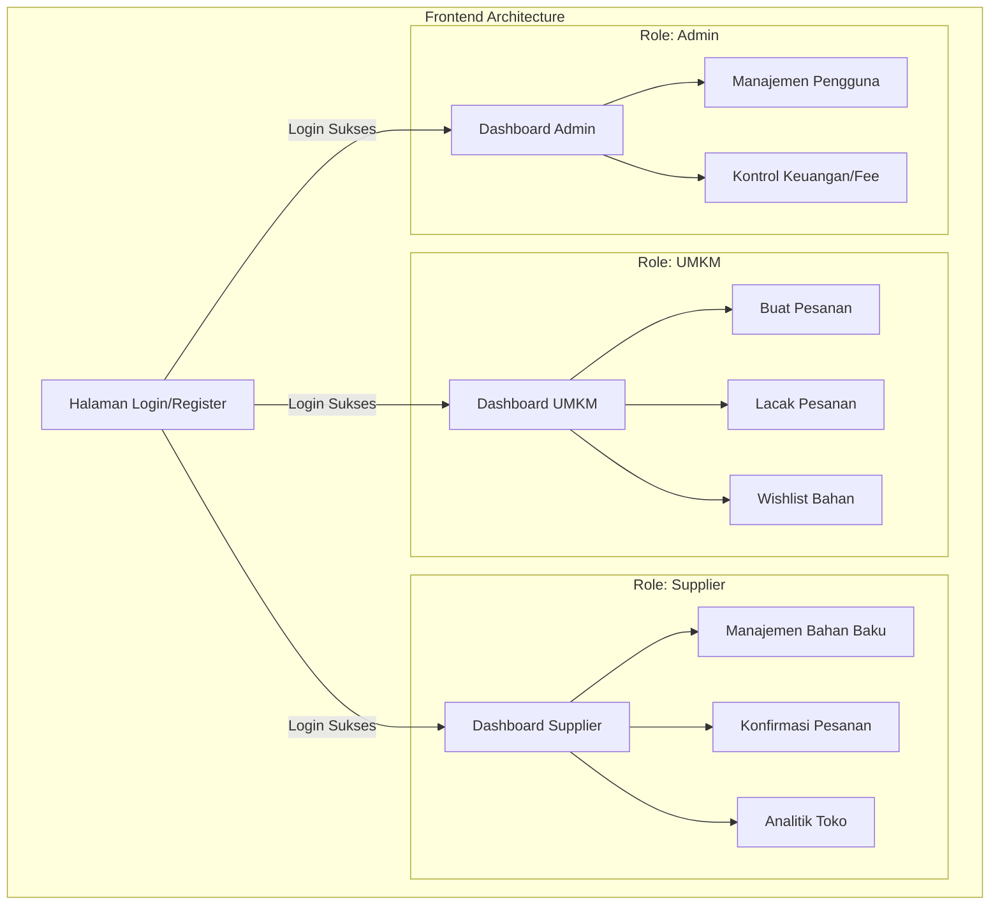
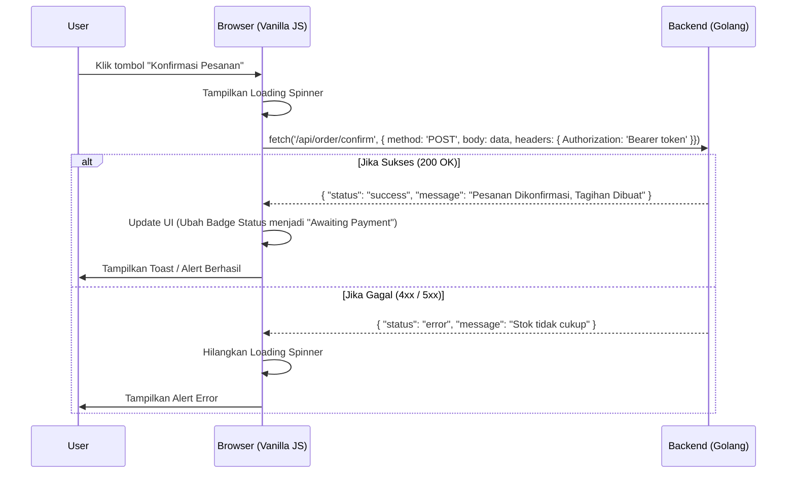

# SupplierHub - Frontend Product Requirements Document (PRD)

## 1. Pendahuluan

Dokumen ini menjelaskan spesifikasi kebutuhan produk (PRD) untuk sisi Frontend dari aplikasi **SupplierHub** (Kelompok 4). Frontend ini bertanggung jawab sebagai antarmuka pengguna bagi tiga aktor utama: UMKM, Supplier, dan Admin, untuk memfasilitasi transaksi pasokan bahan baku secara B2B.

## 2. Spesifikasi Teknologi

Frontend dikembangkan menggunakan pendekatan murni/native tanpa _heavy framework_ agar ringan dan sesuai spesifikasi:

- **Markup & Layouting**: HTML5
- **Styling**: TailwindCSS (dapat di-_load_ via CDN atau _build process_) untuk mempermudah pembuatan UI yang responsif dan modern.
- **Interaktivitas & Logika**: Vanilla JavaScript (ES6+).
- **Integrasi API**: Menggunakan `Fetch API` bawaan browser.
- **State Management**: `localStorage` atau `sessionStorage` untuk menyimpan token autentikasi (JWT) dan data _user session_ sederhana.

## 3. Arsitektur Frontend & Navigasi

## 4. Daftar Halaman Utama & Fungsionalitas

### A. Autentikasi (`Login/`)

- **`login.html`**
  - **Fungsi**: Menerima input email dan password. Melakukan validasi peran (Role) untuk mengarahkan pengguna ke dashboard yang tepat (UMKM, Supplier, Admin).
  - **Integrasi**: `POST /api/auth/login` (Menyimpan Token JWT di localStorage).

### B. Modul UMKM (`dashboard/umkm*.html`)

- **`umkm.html` (Dashboard)**: Menampilkan ringkasan bahan baku yang tersedia dari berbagai Supplier dan tombol CTA untuk memesan.
- **`umkm_pesanan_saya.html`**: Menampilkan tabel riwayat pesanan (Status: _Pending_, _Awaiting Payment_, _Paid_, _Shipped_).
  - Terdapat tombol untuk meneruskan ke SmartBank jika status = _Awaiting Payment_.
- **`umkm_lacak_paket.html`**: Halaman integrasi dengan LogistiKita untuk melihat resi dan _tracking_ pesanan.

### C. Modul Supplier (`dashboard/supplier*.html`)

- **`supplier.html` (Dashboard)**: Menampilkan overview pesanan masuk dan statistik penjualan sederhana.
- **`supplier_produk_saya.html` (Manajemen Stok & Harga)**: Form dan tabel untuk CRUD bahan baku (Nama, Kategori, Harga Satuan, Stok).
  - **Integrasi**: `GET`, `POST`, `PUT /api/supplier/items`.
- **`supplier_daftar_pesanan.html` (Konfirmasi Pesanan)**: Menampilkan list pesanan dari UMKM. Supplier bisa menyetujui (Konfirmasi Ketersediaan) atau Menolak.
  - Saat Supplier "Setuju", JS akan menembak endpoint backend untuk kalkulasi 3% fee layanan dan mengirim tagihan.

### D. Modul Admin (`dashboard/admin*.html`)

- **`admin.html`**: Menampilkan ringkasan ekosistem SupplierHub.
- **`admin_keuangan.html`**: Halaman untuk memantau akumulasi _Fee_ 3% yang masuk sebagai pendapatan sistem SupplierHub.

## 5. Flow Integrasi Frontend ke Backend (JS Fetch Logic)

## 6. Standar Pengkodean UI (UI/UX Guidelines)

- **Komponen**: Gunakan utility classes dari Tailwind untuk _Cards_, _Buttons_, _Modals_, dan _Tables_.
- **Responsivitas**: Wajib menyertakan _breakpoint_ Tailwind (`md:`, `lg:`) agar optimal diakses via mobile maupun desktop.
- **Feedback Visual**:
  - Gunakan Skeleton Loading saat mengambil data dari API.
  - Gunakan warna _Semantic_: Hijau (`bg-green-500`) untuk Sukses/Lunas, Kuning (`bg-yellow-500`) untuk Pending, Merah (`bg-red-500`) untuk Error/Tolak.

---

**Status Dokumen:** ✅ Selesai
