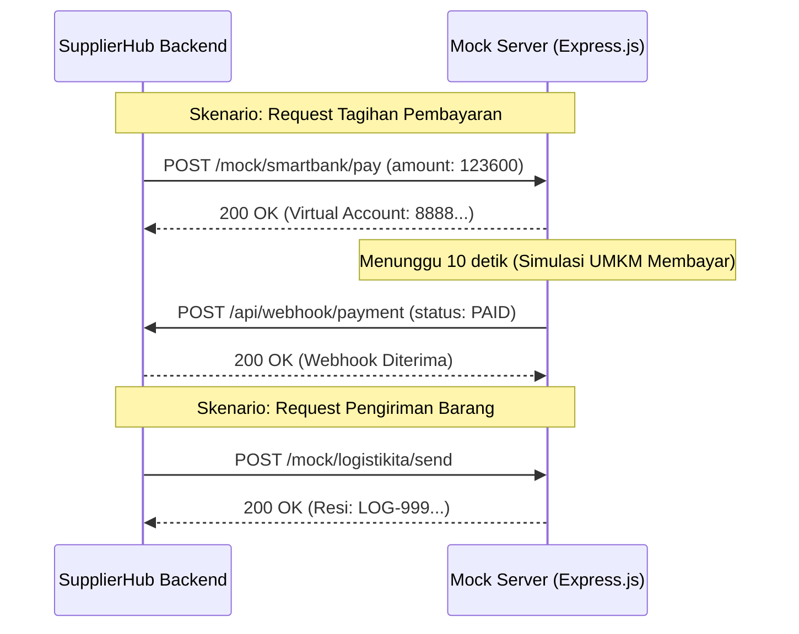

# SupplierHub - Mock Server Product Requirements Document (PRD)

## 1. Pendahuluan

Dokumen ini merincikan spesifikasi untuk **Mock Server** dalam proyek ekosistem Kelompok 4 (SupplierHub). Dikarenakan aplikasi lain dalam satu ekosistem (API Gateway, SmartBank, LogistiKita) mungkin belum tersedia atau berjalan bersamaan selama masa _development_, Mock Server dibutuhkan untuk mensimulasikan respons dari sistem-sistem eksternal tersebut.

## 2. Arsitektur & Teknologi

- **Platform**: Node.js (Express.js) atau Python (FastAPI/Flask) — _sangat disarankan Node.js dengan Express.js karena pembuatannya sangat cepat_.
- **Tujuan**: Hanya mengembalikan _dummy JSON response_ dan memberikan jeda waktu (timeout) untuk menyimulasikan latensi jaringan.
- **Port**: Dijalankan di localhost, misalnya Port `4000` atau `8080`.

## 3. Spesifikasi Mock Endpoint

Mock Server ini akan memalsukan (mock) tiga layanan utama:

### A. API Gateway Mock

Secara teori, semua request eksternal masuk via Gateway. Dalam mock ini, kita bisa mensimulasikan Gateway sekadar meneruskan (forward) request.

- **Endpoint Utama**: `POST /gateway/forward`
- **Perilaku**: Menerima request dari Backend SupplierHub, mengecek header tujuan, dan mengembalikan HTTP 200 OK dengan memanggil fungsi mock di bawahnya.

### B. SmartBank Mock (Sistem Pembayaran)

Menerima permintaan pembuatan tagihan (_Payment Request_) dan secara asinkron memanggil balik (webhook) ke SupplierHub.

- **`POST /mock/smartbank/pay`**
  - **Fungsi**: Menerima data pesanan (Total Biaya termasuk fee 3%).
  - **Request dari SupplierHub**:
    ```json
    {
      "order_id": "ORD-123",
      "amount": 123600,
      "callback_url": "http://localhost:3000/api/webhook/payment"
    }
    ```
  - **Perilaku Mock**:
    1. Mengembalikan response HTTP 200: `{ "status": "Pending", "virtual_account": "8888-1234-5678" }`.
    2. Menunggu (_delay_) selama 10 detik (menggunakan `setTimeout`).
    3. Setelah 10 detik, mock server secara otomatis menembak _HTTP POST_ ke `callback_url` dengan payload `{ "order_id": "ORD-123", "payment_status": "PAID" }` untuk mensimulasikan UMKM berhasil membayar.

### C. LogistiKita Mock (Sistem Pengiriman)

- **`POST /mock/logistikita/send`**
  - **Fungsi**: Mensimulasikan pembuatan resi pengiriman setelah pembayaran dinyatakan lunas.
  - **Request dari SupplierHub**:
    ```json
    {
      "order_id": "ORD-123",
      "pickup_address": "Gudang Supplier",
      "delivery_address": "Toko UMKM"
    }
    ```
  - **Response (200 OK)**:
    ```json
    {
      "status": "success",
      "resi": "LOG-999888777",
      "estimated_delivery": "2 Hari"
    }
    ```

## 4. Diagram Alur Mock Server



## 5. Script Sederhana Node.js (Referensi)

```javascript
// server.js (Mock Server)
const express = require("express");
const axios = require("axios");
const app = express();
app.use(express.json());

app.post("/mock/smartbank/pay", (req, res) => {
  const { order_id, callback_url } = req.body;

  // Balas respon secepatnya
  res.json({ status: "Pending", virtual_account: "8888123" });

  // Simulasi Webhook setelah 10 detik
  setTimeout(() => {
    axios
      .post(callback_url, { order_id: order_id, payment_status: "PAID" })
      .catch((err) => console.log("Webhook failed: ", err.message));
  }, 10000);
});

app.post("/mock/logistikita/send", (req, res) => {
  res.json({ status: "success", resi: "LOG-12345" });
});

app.listen(4000, () => console.log("Mock Server running on port 4000"));
```

---

**Status Dokumen:** ✅ Selesai
